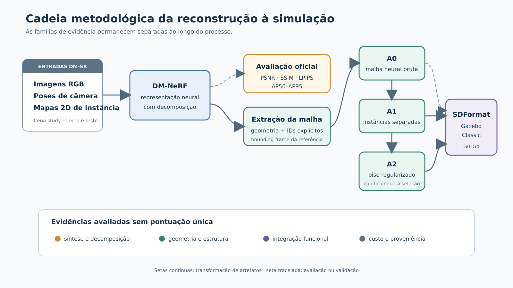
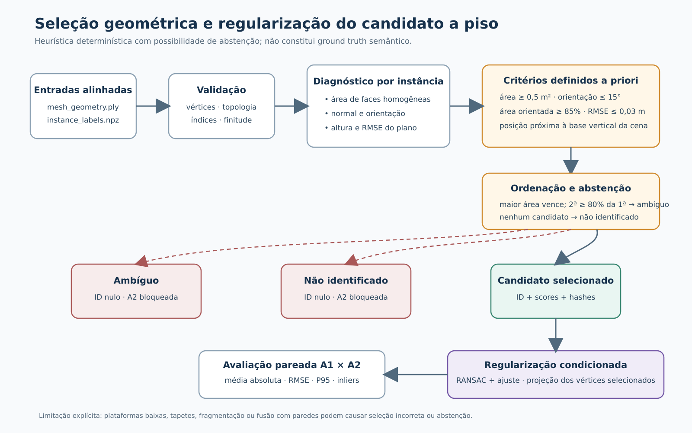
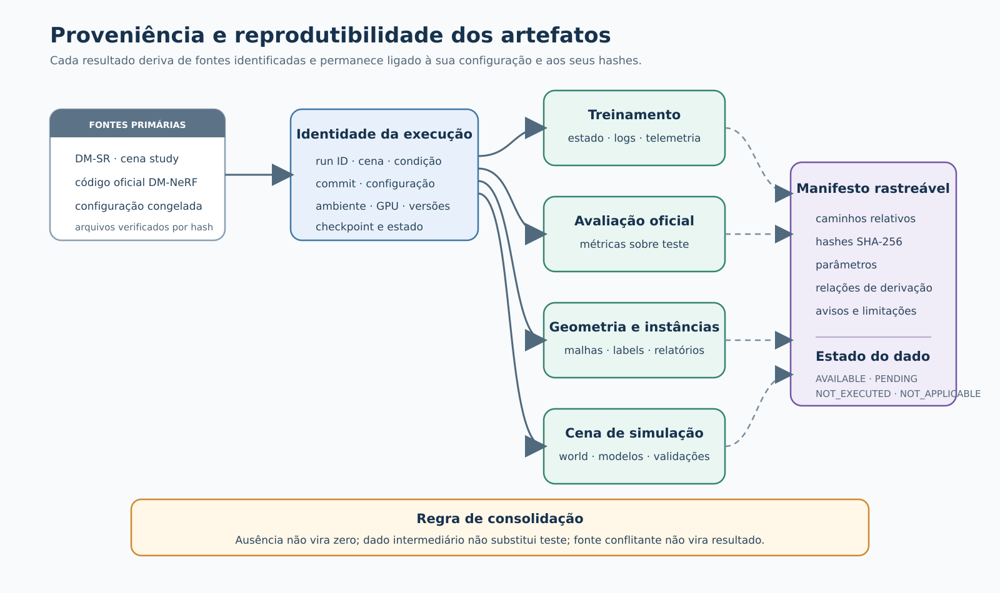

# Título provisório: Reconstrução neural de cenas domésticas estruturadas para simulação robótica

> **Título provisório.** Na qualificação, o trabalho foi apresentado como *Reconstrução Semântica Automatizada de Ambientes Domésticos para Simulação de Robôs*. A consolidação do título será discutida com o orientador.

## 1 Introdução

A construção de ambientes virtuais para robótica exige mais do que uma representação visualmente plausível de uma cena. Em aplicações de simulação, os elementos do ambiente precisam ser descritos de forma explícita, individualizável e compatível com os mecanismos de visualização e colisão do simulador. Uma reconstrução que sintetiza novas vistas com baixo erro pode ainda apresentar superfícies descontínuas, objetos fundidos ou uma organização inadequada para manipulação no espaço virtual. Da mesma forma, uma malha que pode ser carregada por um simulador não é, por esse motivo, geometricamente fiel ao ambiente observado. Essas propriedades estão relacionadas, mas não são equivalentes e devem ser avaliadas separadamente.

Os campos de radiância neurais, introduzidos por Mildenhall et al. (2020), mostraram que uma cena estática pode ser representada implicitamente a partir de imagens com poses conhecidas, permitindo a síntese de vistas não observadas durante o treinamento. Essa formulação motivou diferentes linhas de pesquisa, entre elas a reconstrução de superfícies, o mapeamento para robótica e a incorporação de estrutura semântica ou orientada a objetos. No entanto, a saída de uma representação neural implícita não constitui automaticamente um ambiente estruturado para simulação. Para esse uso, é necessário extrair geometria explícita, preservar ou recuperar a individualidade dos elementos e produzir uma descrição de cena que possa ser carregada e testada em um simulador.

O DM-NeRF, proposto por Wang, Chen e Yang (2023), combina a representação neural da cena com sua decomposição em instâncias. O método constitui o componente neural adotado nesta dissertação e é utilizado com o conjunto de dados DM-SR. Nesse protocolo, o treinamento não recebe somente imagens RGB: também utiliza poses de câmera e mapas bidimensionais de instância. Portanto, a decomposição obtida não deve ser descrita como descoberta sem supervisão semântica a partir de RGB, nem como resultado de um segmentador incorporado posteriormente à cadeia. A supervisão de instâncias faz parte da entrada experimental do método.

Esta dissertação investiga a etapa seguinte desse processo. O interesse central está em verificar em que medida a reconstrução neural decomposta pode ser convertida em uma representação explícita e estruturada de uma cena doméstica, adequada a ensaios de simulação robótica. A cadeia estudada compreende a reprodução do DM-NeRF no DM-SR, a extração de uma malha, a associação explícita de identificadores de instância aos vértices, a separação estrutural dos objetos, a identificação geométrica de um candidato a piso, a regularização dessa superfície e a geração de uma cena para o Gazebo Classic.

O SDFormat é utilizado como mecanismo de serialização e integração com o simulador, sem ser tratado como contribuição científica do trabalho. De modo semelhante, a dissertação não propõe uma nova arquitetura de campo neural, uma nova função de perda ou um novo método de segmentação. A contribuição está na formulação e na avaliação rastreável da passagem entre a representação neural decomposta e uma representação explícita para simulação, distinguindo qualidade de imagem, decomposição, geometria, efeito do pós-processamento e funcionamento no simulador.

### 1.1 Contextualização do problema

Ambientes simulados são empregados no desenvolvimento de sistemas de navegação, percepção e planejamento robótico. Em muitos casos, esses ambientes são construídos manualmente ou derivados de modelos tridimensionais preparados previamente. A reconstrução a partir de imagens oferece uma alternativa para representar espaços existentes, mas introduz um problema de compatibilidade entre duas classes de representação. De um lado, métodos neurais podem modelar aparência e ocupação de maneira contínua e implícita. De outro, simuladores como o Gazebo Classic operam sobre entidades explícitas, organizadas em modelos, links, geometrias visuais e geometrias de colisão.

Essa diferença não é apenas uma questão de formato de arquivo. Uma cena reconstruída como uma única malha não permite, sem processamento adicional, selecionar, remover ou reposicionar um objeto independentemente. Superfícies de suporte com ruído ou deformações podem produzir contatos instáveis ou colisões espúrias. Além disso, atributos físicos como massa, atrito, inércia e articulações não podem ser deduzidos de forma geral apenas a partir das imagens usadas na reconstrução. Assim, a conversão para um simulador deve ser entendida como uma transformação com hipóteses e limites próprios, e não como uma reprodução física completa do ambiente real.

Outro aspecto é a necessidade de separar as evidências experimentais. PSNR, SSIM e LPIPS caracterizam a síntese de vistas, enquanto medidas de Average Precision avaliam a decomposição de instâncias no protocolo oficial do DM-NeRF. Essas métricas não medem diretamente a proximidade entre a superfície reconstruída e uma referência tridimensional. Da mesma maneira, o carregamento bem-sucedido de uma cena no Gazebo não demonstra precisão geométrica. Um protocolo adequado precisa manter essas famílias de métricas separadas e relacioná-las apenas às etapas que efetivamente podem alterar.

### 1.2 Questão de pesquisa

A questão que orienta o estudo é:

> **Em que medida uma reconstrução neural com decomposição de instâncias, combinada a pós-processamento geométrico, permite gerar ambientes domésticos estruturados para simulação robótica?**

A expressão “em que medida” indica que a resposta não será reduzida a uma decisão binária. A cadeia será examinada segundo diferentes dimensões: reprodução do componente neural, síntese de vistas, decomposição de instâncias, qualidade geométrica da malha, individualização dos elementos, planaridade do piso, integração funcional no simulador e custo computacional. O estudo não parte da hipótese de que o DM-NeRF seja superior a outros métodos. O objetivo é caracterizar o comportamento da cadeia adotada e o efeito das transformações realizadas após a reconstrução.

### 1.3 Objetivos

O objetivo geral é **avaliar a capacidade de uma cadeia baseada em DM-NeRF e pós-processamento geométrico de transformar reconstruções neuralmente decompostas em ambientes domésticos estruturados para simulação robótica**.

Para alcançar esse objetivo, são definidos os seguintes objetivos específicos:

1. reproduzir e caracterizar a reconstrução e a decomposição da cena *study* do DM-SR com o DM-NeRF;
2. avaliar a síntese de vistas e a decomposição de instâncias por meio do protocolo oficial do método;
3. analisar a geometria explícita extraída, mantendo essa dimensão separada das métricas de imagem;
4. avaliar a transformação dos identificadores de instância em objetos tridimensionais independentes, sem inferir identidade a partir das cores da malha;
5. investigar a seleção geométrica de um candidato a piso, diante da ausência de rótulo semântico oficial, e quantificar de forma pareada o efeito de sua regularização;
6. avaliar a integração da cena estruturada no Gazebo Classic por critérios funcionais previamente definidos; e
7. comparar as condições A0, A1 e A2, caracterizando também o custo computacional e as condições necessárias à reprodução do experimento, sem atribuir a uma etapa efeitos que ela não pode produzir.

### 1.4 Delimitação e contribuição

O escopo experimental está restrito ao DM-NeRF como método neural principal e ao DM-SR como conjunto de dados principal. A cena *study* é utilizada como caso experimental. Não fazem parte da cadeia proposta a substituição do DM-NeRF por outro reconstrutor neural, a introdução de um novo segmentador, a recuperação de modelos CAD ou a migração para outro simulador. Um termo de comparação externo só poderá aparecer como evidência complementar caso seja efetivamente executado e avaliado pelo mesmo protocolo geométrico; sua preparação, isoladamente, não constitui resultado.

A contribuição pretendida é uma avaliação sistemática e reproduzível da transição entre uma cena neuralmente reconstruída e decomposta e uma representação explícita voltada à simulação. Isso inclui a definição das condições de ablação, a separação das famílias de métricas, o tratamento explícito da ausência de semântica do piso, a preservação da proveniência dos artefatos e a análise das limitações introduzidas pela extração da malha e pelo pós-processamento.

O restante deste texto está organizado da seguinte forma. A Seção 2 situa o trabalho em relação às representações neurais de cenas, à reconstrução de superfícies, ao mapeamento neural para robótica e às representações orientadas a objetos. A Seção 3 descreve a cadeia metodológica. A Seção 4 apresenta o protocolo experimental e suas métricas. A Seção 5 estabelece a estrutura dos resultados ainda pendentes, seguida das limitações metodológicas, da organização prevista para a discussão e das considerações finais provisórias.

## 2 Trabalhos relacionados

### 2.1 Representações neurais de cenas

O NeRF representa uma cena por uma função neural contínua que relaciona posição e direção de observação a densidade volumétrica e cor (Mildenhall et al., 2020). A renderização volumétrica dessa função permite gerar imagens a partir de pontos de vista não apresentados durante o treinamento. O método estabeleceu uma referência para síntese neural de novas vistas, mas sua formulação original não foi concebida como uma descrição explícita e estruturada para simuladores. Em particular, qualidade de renderização não implica, por si só, uma superfície adequada a colisões ou uma decomposição manipulável dos objetos presentes.

Trabalhos como NeuS, de Wang et al. (2021), e VolSDF, de Yariv et al. (2021), tratam mais diretamente da relação entre representação implícita, renderização volumétrica e reconstrução de superfícies. Esses trabalhos mostram que a obtenção de geometria requer formulações específicas e reforçam a necessidade de não usar apenas métricas de imagem para concluir sobre fidelidade geométrica. Nesta dissertação, NeuS e VolSDF cumprem esse papel de contextualização. Eles não são estabelecidos como termos de comparação obrigatórios nem adicionados à cadeia experimental.

### 2.2 Representações neurais em robótica

O uso de representações implícitas também alcançou problemas de mapeamento e localização. O iMAP emprega uma representação neural para realizar mapeamento e posicionamento em tempo real (Sucar et al., 2021). O NICE-SLAM, por sua vez, explora uma codificação implícita escalável para SLAM em ambientes internos (Zhu et al., 2022). Esses trabalhos evidenciam o interesse da robótica por representações contínuas e aprendidas da cena. Contudo, os objetivos, entradas e protocolos desses sistemas diferem dos adotados aqui. Por isso, eles contextualizam a aproximação entre representação neural e robótica, mas não são usados para comparação quantitativa direta.

Para um simulador, a utilidade de uma reconstrução depende também da organização da cena. A presença de uma superfície em uma representação implícita não significa que ela esteja disponível como um objeto independente, com uma geometria de colisão resolvível e uma identidade estável no arquivo de mundo. Essa lacuna motiva o foco desta dissertação na estruturação posterior da saída neural.

### 2.3 Representações orientadas a objetos e decomposição

Panoptic Neural Fields introduz uma representação neural de cena orientada à segmentação panóptica, distinguindo estrutura semântica e objetos (Kundu et al., 2022). O trabalho é relevante por mostrar que campos neurais podem incorporar organização além de aparência e densidade. Entretanto, ele não substitui o método adotado nesta dissertação nem é integrado à cadeia experimental.

O DM-NeRF é o trabalho mais diretamente relacionado ao componente neural aqui utilizado. Wang, Chen e Yang (2023) propõem uma representação destinada à decomposição geométrica e à manipulação da cena a partir de imagens bidimensionais. No protocolo DM-SR, o método é treinado com imagens RGB, poses conhecidas e mapas 2D de instância. Sua saída permite associar regiões da reconstrução a identificadores de instância, fornecendo a base para a individualização posterior das geometrias.

A adoção do DM-NeRF não elimina, contudo, as etapas necessárias para a simulação. A decomposição produzida precisa ser materializada em arquivos de malha separados; faces em fronteiras entre rótulos precisam ser tratadas explicitamente; a orientação e a escala da cena devem ser registradas; e superfícies usadas para suporte e colisão precisam ser avaliadas. É nesse intervalo entre a saída do método neural e a cena operacional no simulador que se concentra o presente trabalho.

### 2.4 Comparação crítica com métodos relacionados

A literatura relacionada cobre diferentes pontos entre reconstrução neural, compreensão panóptica e geração de conteúdo para simulação. Por isso, a comparação a seguir é qualitativa e não estabelece uma ordenação única entre os métodos.

| Trabalho | Entrada principal | Saída/representação | Estrutura de instâncias | Geometria explícita | Destino para simulação |
|---|---|---|---|---|---|
| DM-NeRF (Wang, Chen e Yang, 2023) | RGB, poses e máscaras 2D no DM-SR | campo neural com decomposição por objeto | sim | por extração posterior de malha | não é o objetivo final |
| Panoptic Neural Fields (Kundu et al., 2022) | imagens e predições auxiliares 2D | campo neural orientado a objetos | sim | representação principal neural | não é o objetivo final |
| Panoptic Lifting (Siddiqui et al., 2023) | imagens, poses e máscaras panópticas 2D | campo neural panóptico 3D | sim, com associação entre vistas | representação principal neural | não é o objetivo final |
| PanoRecon (Wu, Yan e Zha, 2024) | vídeo monocular RGB | reconstrução panóptica 3D incremental | sim | sim | não gera diretamente uma cena robótica |
| URDFormer (Chen et al., 2024) | imagem RGB e detecção de partes | URDF com ativos e estrutura articulada | sim | sim, por ativos predefinidos | sim |
| DRAWER (Xia et al., 2025) | vídeo de cena interna | SDF neural, Gaussian splats e articulação | sim | sim | sim |
| GRS (Zook et al., 2025) | observação RGB-D | compreensão da cena, ativos prontos e tarefas | sim | usa principalmente ativos de simulação | sim |
| Cadeia desta dissertação | RGB, poses e máscaras 2D do DM-SR | DM-NeRF, malha, objetos separados, piso e SDFormat | sim | sim | Gazebo Classic |

DM-NeRF, Panoptic Neural Fields e Panoptic Lifting estão mais próximos do início da cadeia: incorporam estrutura de objeto ou informação panóptica a representações neurais, mas não têm como objetivo final converter a saída em uma cena robótica composta por entidades explicitamente organizadas. PanoRecon aproxima-se da combinação entre geometria explícita e instâncias, mas seu destino principal continua sendo a reconstrução e compreensão 3D.

URDFormer, DRAWER e GRS aproximam-se diretamente do problema real-to-sim, porém adotam estratégias diferentes. URDFormer prevê URDFs articulados usando ativos predefinidos; DRAWER combina reconstrução geométrica detalhada, aparência fotorealista e articulações; GRS parte de uma observação RGB-D e associa elementos detectados a ativos preparados para simulação, além de gerar tarefas. Esses trabalhos mostram que uma cena simulável pode ser obtida por estratégias distintas de reconstrução e composição.

A cadeia desta dissertação preserva a geometria reconstruída pelo DM-NeRF como ponto de partida e concentra-se em torná-la explícita, individualizável e utilizável no Gazebo Classic. Não são inferidas articulações, massa, atrito ou outras propriedades dinâmicas. A contribuição defendida não é uma superioridade geral perante esses sistemas, mas a avaliação rastreável da transição entre uma reconstrução neural decomposta e uma cena explícita de simulação.

Essa comparação de literatura não substitui a comparação experimental. A0/A1/A2 constituem uma ablação interna. O COLMAP+dense MVS preparado para a cena *study*, se executado, funcionará somente como termo de comparação geométrica externo, pois não fornece decomposição por instâncias, semântica ou integração com o simulador. Valores publicados pelos demais métodos não serão transportados para as tabelas experimentais, pois entradas, datasets e protocolos não são diretamente equivalentes.

> **Nota de rastreabilidade:** nesta versão, “GRS” refere-se ao trabalho de Zook et al. (2025), *Generating Robotic Simulation Tasks from Real-World Images*. A correspondência com a sigla usada no slide da qualificação será conferida na revisão final do material da apresentação.

### 2.5 Relação com o trabalho anterior

Resultados históricos para cenas do DM-SR foram apresentados por Lemos et al. (2025) em *Digital Environment Description and Reconstruction Using Panoptic Segmentation*, incluindo a cena *Study Room*. Esses valores pertencem ao trabalho anterior e não são tratados como reprodução do experimento de 2026. A presente dissertação estabelece uma nova cadeia de proveniência, composta por configuração, versão do código, ponto de salvamento, registros de execução, ambiente e métricas brutas. Consequentemente, nenhum valor histórico é utilizado para preencher lacunas dos resultados atuais.

## 3 Metodologia

### 3.1 Delineamento geral

O estudo é organizado como uma avaliação experimental de uma cadeia de reconstrução e estruturação de cenas domésticas. O DM-NeRF, executado sobre o DM-SR, constitui o estágio neural. A partir do modelo treinado, são obtidas as métricas oficiais de síntese e decomposição e é extraída uma representação geométrica explícita. Essa representação é então processada para produzir objetos independentes, identificar um candidato geométrico a piso, regularizar a superfície selecionada e gerar uma cena para o Gazebo Classic.

O delineamento separa três níveis de evidência. O primeiro corresponde ao componente neural e reúne métricas de síntese de vistas e decomposição de instâncias. O segundo corresponde à geometria explícita e inclui distâncias de superfície e medidas de precisão e completude. O terceiro corresponde às transformações introduzidas pelo pós-processamento e à integração funcional no simulador. Essa separação impede que uma melhoria ou falha observada em uma dimensão seja automaticamente atribuída às demais.

A Figura 1 sintetiza a cadeia metodológica e explicita a separação entre avaliação neural, processamento geométrico e validação funcional.

*Figura 1 — Visão geral da cadeia metodológica, desde as entradas do DM-SR até a avaliação e a geração das condições A0, A1 e A2 para integração no Gazebo Classic. Fonte: elaboração própria.*

### 3.2 Conjunto de dados DM-SR

O conjunto DM-SR fornece os dados utilizados pelo protocolo oficial do DM-NeRF. Para a cena *study*, os artefatos inspecionados incluem imagens RGB, poses de câmera, mapas de instância para treino e teste, parâmetros de câmera, paleta de cores e uma malha tridimensional de referência. Foram verificados 300 mapas de instância de treinamento e 100 de teste, com resolução de 400 × 400 pixels e identificadores inteiros no intervalo observado de 0 a 12. Esses identificadores não vêm acompanhados de um catálogo semântico completo que associe cada número a uma classe do ambiente.

A malha de referência é empregada tanto na avaliação geométrica quanto pelo procedimento oficial de extração da malha. Essa dupla participação requer cuidado metodológico. A implementação oficial obtém da referência o *oriented bounding box* que define o volume e a orientação da grade na qual o campo neural é consultado. A referência não fornece os valores de densidade previstos pela rede, mas participa da definição do domínio de extração. Por isso, a comparação posterior entre a malha prevista e essa mesma referência não é inteiramente independente.

### 3.3 Reconstrução e decomposição com DM-NeRF

O DM-NeRF recebe imagens RGB, poses de câmera e supervisão bidimensional de instâncias. O treinamento produz uma representação implícita que permite sintetizar novas vistas e estimar a decomposição da cena. A dissertação preserva o método principal e suas definições de avaliação. Adaptações introduzidas para compatibilidade de ambiente, retomada do treinamento e execução em sessões limitadas são registradas como condições de reprodução, sem alteração das funções de perda, do conjunto de dados ou do protocolo científico.

O treinamento final admite retomada com preservação do estado do otimizador, do gerador de números aleatórios e, quando aplicável, do escalonador de precisão mista. As atualizações não aplicadas pelo mecanismo de escalonamento são contabilizadas separadamente. A avaliação e a extração da malha são realizadas após a conclusão do treinamento final. Ensaios preliminares de infraestrutura e desempenho servem somente para verificar a execução e dimensionar recursos, sem integrar os resultados científicos.

O avaliador oficial fornece PSNR, SSIM e LPIPS para síntese de vistas, além de *Average Precision* de instâncias nos limiares de IoU 0,50, 0,75, 0,80, 0,85, 0,90 e 0,95. Esses valores são obtidos sobre o conjunto de teste. A função de perda do treinamento, as métricas intermediárias e as medidas de desempenho computacional não são reutilizadas como substitutos das métricas de teste.

### 3.4 Extração da malha e rótulos explícitos

Após o treinamento, o campo neural é consultado no volume definido pelo procedimento oficial e convertido em uma malha triangular. A análise considera a geometria explícita, uma visualização colorida por instância, a associação entre vértices e identificadores de instância e a referência tridimensional da cena. A associação de instâncias é armazenada de modo independente da cor, por meio de um vetor `vertex_instance_id` alinhado aos vértices e triângulos da malha.

Antes de qualquer separação, são verificadas a quantidade e a ordem dos vértices, a validade dos índices de triângulos, a correspondência da topologia e a finitude das coordenadas. Essa verificação evita transferir identificadores entre malhas que apenas parecem semelhantes, mas que possuem ordem ou conectividade distintas. Cores podem ser utilizadas para visualização, porém não são interpretadas como identidade semântica ou como fonte principal dos identificadores.

### 3.5 Separação estrutural dos objetos

A individualização dos objetos utiliza diretamente os identificadores explícitos associados aos vértices. Para cada instância, são selecionadas apenas faces cujos três vértices possuem o mesmo identificador. Os vértices utilizados são remapeados para uma malha independente, e cada arquivo recebe um nome determinístico derivado do `instance_id`. O procedimento registra área, limites espaciais, centroide, número de vértices e número de faces por instância.

Faces cujos vértices apresentam identificadores diferentes são classificadas como faces de fronteira. Elas não são atribuídas silenciosamente a uma das instâncias. Sua quantidade e a cobertura de faces homogêneas são registradas, pois a omissão pode produzir aberturas nas malhas separadas. Esse tratamento prioriza rastreabilidade em relação a uma decisão arbitrária de pertencimento.

A separação não altera, por si só, a geometria das faces preservadas. Por esse motivo, ela não deve receber uma alegação de melhora em PSNR, SSIM, LPIPS ou distância de superfície. Sua evidência é estrutural e funcional: a geração de entidades independentes e a possibilidade de selecionar, remover ou reposicionar um modelo sem modificar a malha global.

A Figura 2 apresenta as transformações encadeadas de A0, A1 e A2 e delimita as evidências pertinentes a cada condição.

*Figura 2 — Condições encadeadas da ablação e famílias de evidência pertinentes a cada transformação. Fonte: elaboração própria.*

### 3.6 Identificação geométrica do piso

A inspeção dos artefatos oficiais da cena *study* não encontrou informação semântica suficiente para mapear um `instance_id` específico à classe piso. Os arquivos de poses e transformações não contêm classes; os mapas 2D possuem apenas IDs inteiros; a paleta associa IDs a cores, mas não a nomes semânticos; e os arquivos de objetos rígidos identificam alguns móveis, sem registrar o piso. A malha de referência também não apresenta propriedade de classe ou instância. Assim, nenhum ID pode ser declarado como ground truth semântico do piso a partir das fontes disponíveis.

Em consequência, a seleção é formulada explicitamente como uma heurística geométrica determinística. Ela recebe a malha e os rótulos explícitos da mesma extração, valida sua correspondência e considera somente faces homogêneas. Para cada instância, ajusta-se um plano a partir da covariância dos vértices das faces, com ponderação pela área dos triângulos. São registrados área, normal, altura do centro ponderado e RMSE do ajuste.

Uma instância é elegível quando satisfaz conjuntamente os critérios definidos antes da observação da malha final: área mínima de 0,5 m²; pelo menos 85% da área com orientação até 15 graus da vertical; normal do plano dentro do mesmo limite angular; RMSE máximo de 0,03 m; e altura situada até o percentil 1 das alturas da cena acrescido de 20% da amplitude vertical. O eixo vertical padrão da malha é +Y, conforme a convenção verificada para esse artefato. Outras convenções exigem declaração explícita.

Entre as instâncias elegíveis, a área total constitui o escore. A de maior área é selecionada somente se a segunda candidata possuir área inferior a 80% da primeira. Caso contrário, o procedimento retorna estado ambíguo. Se nenhuma instância satisfizer os critérios, retorna que o piso não foi identificado. Nos dois casos, o identificador permanece nulo e a etapa de regularização é bloqueada. O número do ID não é usado como critério de desempate.

A saída registra parâmetros, diagnósticos por instância e hashes das entradas, declarando explicitamente que a evidência é uma heurística geométrica e não um ground truth semântico. Essa formulação reconhece que uma plataforma baixa ou um tapete pode ser selecionado, enquanto um piso fragmentado, fundido com paredes ou incompleto pode causar abstenção. A regra produz um candidato geométrico, não uma classificação semântica comprovada.

### 3.7 Regularização do piso

Quando a seleção retorna um candidato válido, os vértices da instância são usados para estimar um plano por RANSAC, seguido de ajuste aos inliers. A regularização projeta apenas os vértices selecionados sobre o plano estimado. A topologia e os identificadores de instância são preservados. Caso seja necessário alinhar a cena ao referencial do simulador, uma transformação rígida comum pode ser registrada e aplicada de modo explícito; essa transformação não deve ser confundida com uma melhoria da reconstrução.

O efeito da regularização é medido de forma pareada sobre o mesmo subconjunto de piso antes e depois da projeção. São reportados erro absoluto médio, RMSE, percentil 95 da distância absoluta ao plano e fração de inliers. O percentil 95 é a medida primária, pois caracteriza a cauda dos resíduos sem depender apenas de valores extremos isolados. A comparação não usa os vértices como replicações estatísticas independentes: eles pertencem à mesma superfície e à mesma cena.

A Figura 3 reúne os critérios de seleção, os estados de abstenção e a regularização condicionada a uma seleção válida.

*Figura 3 — Fluxo da heurística geométrica de seleção do candidato a piso, incluindo os estados de abstenção e a regularização condicionada. Fonte: elaboração própria.*

### 3.8 Geração da cena no Gazebo Classic

As condições experimentais são exportadas como mundos SDFormat para o Gazebo Classic. Cada instância recebe um nome único e estável derivado do identificador, um link, uma geometria visual e uma geometria de colisão. Visual e colisão apontam para a mesma malha triangular, com escala `1 1 1`. As referências são relativas ao diretório do mundo, de modo que o pacote possa ser movido sem depender de caminhos absolutos da máquina de origem.

A orientação vertical da malha é informada explicitamente. Quando necessário, uma rotação rígida é registrada na pose dos modelos para relacionar o referencial da reconstrução ao eixo +Z do Gazebo. Os objetos preservam a origem comum da cena, evitando translações independentes introduzidas durante a exportação. A proveniência da cena reúne os arquivos gerados, seus identificadores, referências relativas e hashes.

A validação estática verifica que o XML pode ser analisado, que os nomes dos modelos são únicos, que as referências de malha são resolvíveis, que as escalas são finitas e positivas e que links, elementos visuais e colisões estão presentes. Essa etapa não substitui o parser nativo do SDFormat nem um ensaio físico. Malhas não estanques ou com faces de fronteira omitidas podem ser sintaticamente válidas e ainda produzir colisões inadequadas.

## 4 Protocolo experimental

### 4.1 Unidade experimental e execução final

A cena *study* constitui o caso principal do experimento. A cadeia final parte de um único treinamento rastreável e mantém o mesmo identificador de execução nos artefatos derivados. Ensaios preliminares de infraestrutura e desempenho são utilizados para verificar a execução e estimar o custo, mas seus pontos de salvamento e métricas não integram as tabelas científicas finais.

A análise considera o ponto de salvamento final, o estado de treinamento, os registros por iteração, a telemetria de GPU, as métricas oficiais sobre o conjunto de teste, a malha geométrica, a visualização por instâncias, os rótulos explícitos e a referência tridimensional. Resultados parciais podem caracterizar o acompanhamento da execução, porém não substituem o estado final nem são misturados às métricas do conjunto de teste.

### 4.2 Ablação A0/A1/A2

São definidas três condições encadeadas, derivadas da mesma reconstrução:

- **A0 — DM-NeRF raw:** geometria explícita extraída diretamente do campo neural antes do pós-processamento geométrico;
- **A1 — instâncias separadas:** A0 acrescida da separação estrutural por identificadores explícitos, sem alteração intencional das coordenadas preservadas; e
- **A2 — instâncias separadas e piso regularizado:** A1 acrescida da projeção dos vértices do candidato a piso sobre o plano estimado.

A0 caracteriza a saída geométrica do estágio neural. A1 testa a individualização dos elementos, mas não deve ser comparada a A0 por métricas que a separação não altera. A2 isola o efeito da regularização sobre o piso e sobre os ensaios funcionais correspondentes. Se o seletor geométrico retornar `ambiguous` ou `not_identified`, A2 permanece bloqueada; o protocolo não força um ID para completar a tabela.

### 4.3 Métricas de síntese e decomposição

O avaliador oficial do DM-NeRF é utilizado para obter PSNR, SSIM e LPIPS sobre as vistas de teste. A decomposição é avaliada por AP50, AP75, AP80, AP85, AP90 e AP95. A linha média produzida pelo avaliador é preservada como resultado, sem recalcular uma média que a inclua novamente. Essas métricas pertencem ao estágio neural e são associadas à execução final, não individualmente a A1 ou A2.

Não serão usados a função de perda, o PSNR intermediário ou qualquer medida emitida durante o treinamento como resultado de teste. Valores ausentes permanecerão identificados como pendentes. Resultados da publicação anterior poderão ser citados apenas como históricos, com sua fonte, e não serão copiados para a coluna da reprodução atual.

### 4.4 Métricas geométricas

A malha reconstruída e a referência são amostradas na superfície para o cálculo das distâncias ao vizinho mais próximo em ambas as direções. Serão reportadas a distância média da previsão para a referência, a distância média da referência para a previsão, a distância simétrica, os respectivos RMSEs e Precision, Completeness e F-score nos limiares de 1 cm, 2 cm e 5 cm. A amostragem prevista utiliza 200.000 pontos e semente fixa.

Precision expressa a fração dos pontos previstos situados dentro do limiar em relação à referência; Completeness expressa a fração dos pontos da referência cobertos pela previsão; e F-score combina as duas medidas por média harmônica. Nenhuma delas é condensada com métricas de imagem ou de Gazebo em um escore único.

A interpretação dessas medidas considera que o procedimento oficial de extração da malha utiliza o *bounding frame* da própria referência DM-SR. Portanto, os resultados descrevem o comportamento da geometria dentro do protocolo oficial e não uma reconstrução cujo domínio tenha sido determinado de forma completamente independente do *ground truth*.

### 4.5 Métricas do piso

Para o candidato selecionado, A1 e A2 são comparadas por erro absoluto médio, RMSE, P95 e fração de inliers. Os parâmetros do RANSAC, o identificador da instância, a natureza heurística da seleção e os hashes das entradas acompanham os resultados. P95 constitui a medida primária da ablação. Uma redução do residual demonstra apenas maior aderência ao plano definido pelo procedimento; não demonstra, isoladamente, maior fidelidade ao piso real.

### 4.6 Validação funcional

A avaliação no Gazebo é organizada em cinco etapas de validação. G0 verifica estaticamente a integridade do SDFormat e das referências locais. G1 verifica o carregamento da cena no Gazebo Classic sem erro fatal associado aos modelos. G2 verifica a individualização, por meio da transformação independente de instâncias selecionadas. G3 verifica a utilização da superfície regularizada como apoio e colisão na condição A2. G4 corresponde a uma navegação curta e fixa, executada somente se houver configuração histórica reproduzível sem desenvolvimento adicional relevante.

G0 e G1 são aplicáveis a A0, A1 e A2. G2 é aplicável às condições com objetos separados. G3 é exclusivo de A2 e depende de uma seleção de piso válida. G4 também é restrito a A2 e pode permanecer como não executado se sua reprodução exigir uma nova implementação. A ausência de execução e a não aplicabilidade são preservadas como categorias próprias; nenhuma delas é convertida em sucesso.

### 4.7 Custo computacional

O custo computacional é descrito por iteração final, atualizações efetivas, atualizações puladas pelo escalonador AMP, tempo de treinamento, vazão de processamento, tempo por iteração e uso máximo de memória. Serão distinguidos o pico de memória alocada pelo PyTorch e o pico de memória observado pela telemetria do dispositivo. A telemetria também registra o modelo e a utilização da GPU ao longo da execução. As etapas de avaliação e extração da malha possuem tempos próprios e não são somadas ao treinamento quando os intervalos se sobrepõem.

O uso de recursos gratuitos constitui uma restrição prática da reprodução. Essa restrição é registrada, mas não é convertida em argumento de qualidade do método. Projeções obtidas em pilotos servem ao planejamento; somente o custo observado na execução final integra os resultados científicos.

### 4.8 Reprodutibilidade e proveniência

Cada resultado final é associado à cena, à versão do código da dissertação e do código oficial, à configuração, ao ambiente, ao ponto de salvamento e à fonte correspondente. Os artefatos brutos permanecem separados das tabelas derivadas, e as fontes utilizadas recebem caminho relativo e hash SHA-256. A consolidação abrange os registros de treinamento, as métricas oficiais, as avaliações geométricas, os relatórios de piso, a estrutura das instâncias, as validações do Gazebo e, se disponível, a execução efetiva de um termo de comparação externo.

Dados ausentes permanecem identificados como pendentes, enquanto execuções não realizadas e medidas não aplicáveis são distinguidas explicitamente. Valores não finitos, métricas fora de domínio e fontes finais conflitantes são tratados como evidência inválida, e não como resultados. Esse procedimento impede o uso de zero, campos vazios ou números históricos como substitutos de informação ausente.

A Figura 4 resume o vínculo entre as fontes primárias, a identidade da execução, os artefatos derivados e a consolidação das evidências.

*Figura 4 — Encadeamento de proveniência entre fontes primárias, identidade da execução, artefatos derivados e evidências consolidadas. Fonte: elaboração própria.*

## 5 Resultados

O treinamento científico alcançou as 200.000 iterações previstas. A avaliação final e a extração da malha, entretanto, ainda aguardam disponibilidade de GPU. Por esse motivo, todos os campos que ainda não são sustentados pelos artefatos finais permanecem explicitamente identificados como pendentes, e números intermediários não são apresentados nas tabelas abaixo.

### 5.1 Execução e custo computacional

A tabela a seguir reunirá o estado final do treinamento e o custo observado. O número de atualizações puladas pelo AMP será acompanhado da fração em relação ao total de tentativas de atualização. O tempo corresponderá à soma rastreável das sessões pertencentes à mesma sequência de treinamento.

A Figura 5 apresenta os valores já confirmados da execução do treinamento, sem os confundir com métricas de avaliação sobre o conjunto de teste. A execução foi concluída em três sessões pertencentes à mesma sequência de treinamento, totalizando aproximadamente 30 h 58 min, com 199.916 atualizações efetivas e 85 atualizações puladas pelo escalonamento AMP. O pico de memória alocada pelo PyTorch foi de aproximadamente 5,58 GiB; o pico obtido pela telemetria do dispositivo permanece pendente de consolidação.

*Figura 5 — Resumo descritivo da execução científica concluída em três sessões, sem inclusão de métricas de avaliação ou de teste. Fonte: elaboração própria.*

| Iteração final | Atualizações efetivas | Atualizações puladas por AMP | Tempo de treino | Tempo por iteração | Pico PyTorch | Pico da telemetria |
|---:|---:|---:|---:|---:|---:|---:|
| 200.000 | 199.916 | 85 | 30 h 58 min | 0,557 s/it | 5,58 GiB | **PENDENTE** |

### 5.2 Síntese de vistas e decomposição

A tabela a seguir será preenchida exclusivamente a partir do avaliador oficial executado após o treinamento final. Não serão transferidos valores da publicação anterior nem de avaliações preliminares.

| PSNR | SSIM | LPIPS | AP50 | AP75 | AP80 | AP85 | AP90 | AP95 |
|---:|---:|---:|---:|---:|---:|---:|---:|---:|
| **PENDENTE** | **PENDENTE** | **PENDENTE** | **PENDENTE** | **PENDENTE** | **PENDENTE** | **PENDENTE** | **PENDENTE** | **PENDENTE** |

### 5.3 Geometria explícita

A primeira tabela desta subseção apresentará *Precision*, *Completeness* e F-score para os limiares registrados. Como as distâncias direcionais e simétrica não dependem desses limiares, elas serão apresentadas separadamente na tabela seguinte. Essa separação evita repetir o mesmo valor em linhas correspondentes a tolerâncias distintas. A interpretação de ambas será limitada pelo uso da referência no *bounding frame* da extração da malha.

| Condição | Limiar | Precision | Completeness | F-score |
|---|---:|---:|---:|---:|
| A0 | 1 cm | **PENDENTE** | **PENDENTE** | **PENDENTE** |
| A0 | 2 cm | **PENDENTE** | **PENDENTE** | **PENDENTE** |
| A0 | 5 cm | **PENDENTE** | **PENDENTE** | **PENDENTE** |
| A2, se executada | 1 cm | **PENDENTE** | **PENDENTE** | **PENDENTE** |
| A2, se executada | 2 cm | **PENDENTE** | **PENDENTE** | **PENDENTE** |
| A2, se executada | 5 cm | **PENDENTE** | **PENDENTE** | **PENDENTE** |

| Condição | Média Predição→GT | Média GT→Predição | Distância simétrica | RMSE Predição→GT | RMSE GT→Predição |
|---|---:|---:|---:|---:|---:|
| A0 | **PENDENTE** | **PENDENTE** | **PENDENTE** | **PENDENTE** | **PENDENTE** |
| A2, se executada | **PENDENTE** | **PENDENTE** | **PENDENTE** | **PENDENTE** | **PENDENTE** |

### 5.4 Separação de instâncias

A avaliação de A1 registrará o número de instâncias com faces, a cobertura de faces homogêneas, a quantidade de faces de fronteira e os resultados do teste de individualização. Esses indicadores não serão apresentados como melhoria de síntese de vistas ou geometria.

| Condição | Instâncias exportadas | Cobertura de faces | Faces de fronteira | Manipulação independente |
|---|---:|---:|---:|---|
| A1 | **PENDENTE** | **PENDENTE** | **PENDENTE** | **PENDENTE** |
| A2 | **PENDENTE** | **PENDENTE** | **PENDENTE** | **PENDENTE** |

### 5.5 Identificação e regularização do piso

O identificador final não será antecipado. As tabelas desta subseção somente serão preenchidas se o seletor retornar `selected` para os artefatos finais. Em caso de ambiguidade ou ausência de candidato, esse estado será reportado e A2 permanecerá bloqueada.

| Evidência de seleção | `instance_id` | Ground truth semântico | Estado |
|---|---:|---|---|
| Heurística geométrica | **PENDENTE** | Não | **PENDENTE** |

| Condição | Média absoluta | RMSE | P95 | Fração de inliers |
|---|---:|---:|---:|---:|
| A1 — antes | **PENDENTE** | **PENDENTE** | **PENDENTE** | **PENDENTE** |
| A2 — depois | **PENDENTE** | **PENDENTE** | **PENDENTE** | **PENDENTE** |

### 5.6 Validação no Gazebo Classic

| Condição | G0 | G1 | G2 | G3 | G4 |
|---|---|---|---|---|---|
| A0 | **PENDENTE** | **PENDENTE** | NÃO APLICÁVEL | NÃO APLICÁVEL | NÃO APLICÁVEL |
| A1 | **PENDENTE** | **PENDENTE** | **PENDENTE** | NÃO APLICÁVEL | NÃO APLICÁVEL |
| A2 | **PENDENTE** | **PENDENTE** | **PENDENTE** | **PENDENTE** | **PENDENTE/NÃO EXECUTADO** |

O resultado de G0 será interpretado somente como integridade estática. G1 a G4 dependerão de execução real no Gazebo Classic. Os avisos emitidos serão mantidos como parte da evidência, mesmo quando uma etapa for aprovada.

### 5.7 Síntese da ablação

| Condição | Propriedade avaliada | Evidência esperada | Estado atual |
|---|---|---|---|
| A0 | geometria neural bruta | métricas de superfície e integração básica | **PENDENTE** |
| A1 | individualização | manifesto de instâncias e G2 | **PENDENTE** |
| A2 | regularização do piso | planaridade pareada, G3 e eventual G4 | **PENDENTE** |

Essa síntese não será convertida em uma pontuação única. Cada condição será discutida apenas nas propriedades que pode modificar.

## 6 Limitações metodológicas

A primeira limitação decorre da própria supervisão do DM-NeRF no DM-SR. Os mapas bidimensionais de instância participam do treinamento, de modo que a decomposição não é obtida exclusivamente de imagens RGB sem rótulos. Esse fato delimita a interpretação dos APs e a generalização para cenários sem máscaras disponíveis.

A segunda limitação está na avaliação geométrica. O procedimento oficial de extração da malha usa a referência para definir o volume e a orientação da consulta. Embora a rede determine o campo reconstruído, o domínio da extração recebe informação da referência. As métricas geométricas, portanto, caracterizam o protocolo oficial, não uma reconstrução totalmente independente do *ground truth*.

A terceira limitação é a ausência de um rótulo semântico oficial para o piso. A heurística proposta é determinística e auditável, mas suas regras de área, orientação, planaridade e altura não demonstram a classe do objeto. Pisos fragmentados, regiões fundidas e plataformas baixas podem causar erro ou abstenção. A possibilidade de não executar A2 faz parte do protocolo e não será ocultada.

A quarta limitação é a hipótese geométrica da regularização. Projetar uma superfície sobre um plano reduz os resíduos em relação ao plano por construção. Isso não garante maior fidelidade à geometria real, especialmente se a superfície verdadeira não for plana ou se a instância selecionada estiver incorreta. Por essa razão, a dissertação separa a medida de planaridade da avaliação geométrica global e da validação funcional.

A quinta limitação diz respeito à conversão para simulação. Geometria visual e geometria de colisão são derivadas da mesma malha, sem inferência de propriedades físicas. Massa, inércia, atrito, materiais, articulações e comportamento dinâmico não são recuperados. A cena resultante deve ser entendida como um ativo geométrico estruturado para os ensaios definidos, e não como um gêmeo digital fisicamente completo.

Por fim, o estudo utiliza uma cena principal e recursos computacionais gratuitos. Isso limita a diversidade de ambientes e a análise estatística entre cenas. Vértices de uma mesma malha não são considerados amostras independentes para ampliar artificialmente o tamanho experimental. As conclusões deverão permanecer restritas ao caso ensaiado e ao protocolo reproduzido.

## 7 Estrutura da discussão

A discussão final será organizada a partir das dimensões da questão de pesquisa. Primeiro, serão examinadas a reprodução do DM-NeRF e a relação entre qualidade de síntese, decomposição e geometria. Essa análise deverá verificar se as métricas convergem ou se revelam comportamentos distintos, sem assumir que uma boa síntese de vistas implica uma boa superfície.

Em seguida, será discutido o efeito da estruturação. A separação das instâncias será analisada por sua capacidade de produzir entidades independentes e pela cobertura geométrica preservada. As faces de fronteira e eventuais malhas abertas serão tratadas como custos do critério conservador de separação, e não omitidas.

A terceira parte abordará o piso. Caso a heurística selecione uma instância, serão comparados os resíduos antes e depois e o efeito funcional no apoio e na colisão. Caso haja abstenção, a discussão deverá tratar esse resultado como evidência dos limites da informação disponível e da própria decomposição, sem substituí-lo por um ID histórico ou escolhido visualmente.

A quarta parte relacionará a representação ao simulador. As etapas de validação indicarão quais requisitos foram satisfeitos na cena ensaiada. Um eventual sucesso funcional não será usado para concluir fidelidade física, assim como uma falha de integração deverá ser distinguida de uma falha do campo neural.

Por fim, custo e reprodutibilidade serão discutidos como condições práticas de uso. O tempo, a memória e a necessidade de retomadas serão relacionados ao contexto de recursos gratuitos, sem transformar eficiência observada em comparação com métodos que não foram executados sob condições equivalentes.

## 8 Considerações finais

Esta dissertação examina uma cadeia que parte de uma reconstrução neural decomposta e chega a uma representação explícita e estruturada para simulação robótica. A proposta não modifica o DM-NeRF nem atribui contribuição científica ao SDFormat. Seu foco é tornar observável e avaliável o processo de extração, individualização, regularização e integração, com proveniência dos artefatos e separação entre as diferentes famílias de evidência.

Na versão atual, não há base para afirmar o desempenho final da cadeia. A conclusão definitiva dependerá das métricas de teste, da malha final, da seleção geométrica do piso, da ablação A0/A1/A2 e dos ensaios no Gazebo Classic. Após a incorporação desses resultados, a resposta à questão de pesquisa deverá indicar quais propriedades foram preservadas ou modificadas, em quais condições a representação se mostrou utilizável e quais limitações permaneceram.

## Referências

KUNDU, A.; GENOVA, K.; YIN, X.; FATHI, A.; PANTOFARU, C.; GUIBAS, L.; TAGLIASACCHI, A.; DELLAERT, F.; FUNKHOUSER, T. *Panoptic Neural Fields: A Semantic Object-Aware Neural Scene Representation*. Proceedings of the IEEE/CVF Conference on Computer Vision and Pattern Recognition, 2022.

CHEN, Zoey Qiuyu; WALSMAN, Aaron; MEMMEL, Marius; MO, Kaichun; FANG, Alex; FOX, Dieter; GUPTA, Abhishek. *URDFormer: A Pipeline for Constructing Articulated Simulation Environments from Real-World Images*. Proceedings of Robotics: Science and Systems, 2024. DOI: 10.15607/RSS.2024.XX.124.

SIDDIQUI, Yawar; PORZI, Lorenzo; ROTA BULÒ, Samuel; MÜLLER, Norman; NIESSNER, Matthias; DAI, Angela; KONTschIEDER, Peter. *Panoptic Lifting for 3D Scene Understanding With Neural Fields*. Proceedings of the IEEE/CVF Conference on Computer Vision and Pattern Recognition, 2023, p. 9043–9052.

WU, Dong; YAN, Zike; ZHA, Hongbin. *PanoRecon: Real-Time Panoptic 3D Reconstruction from Monocular Video*. Proceedings of the IEEE/CVF Conference on Computer Vision and Pattern Recognition, 2024, p. 21507–21518.

XIA, Hongchi; SU, Entong; MEMMEL, Marius; JAIN, Arhan; YU, Raymond; MBIZIWO-TIAPO, Numfor; FARHADI, Ali; GUPTA, Abhishek; WANG, Shenlong; MA, Wei-Chiu. *DRAWER: Digital Reconstruction and Articulation With Environment Realism*. Proceedings of the IEEE/CVF Conference on Computer Vision and Pattern Recognition, 2025, p. 21771–21782.

ZOOK, Alex; SUN, Fan-Yun; SPJUT, Josef; BLUKIS, Valts; BIRCHFIELD, Stan; TREMBLAY, Jonathan. *GRS: Generating Robotic Simulation Tasks from Real-World Images*. Proceedings of the IEEE/CVF Conference on Computer Vision and Pattern Recognition Workshops, 2025, p. 594–603.

LEMOS, João Francisco de Souza Santos; DORNELES, Gabriel Amaral; MAURELL, Igor Pardo; BRIÃO, Stephanie Loi; GUERRA, Rodrigo da Silva; DREWS JUNIOR, Paulo Lilles Jorge. Digital Environment Description and Reconstruction Using Panoptic Segmentation. In: BARROS, Edna; HANNA, Josiah P.; OKADA, Hiroyuki; TORTA, Elena (org.). *RoboCup 2024: Robot World Cup XXVII*. Cham: Springer, 2025. Lecture Notes in Computer Science, v. 15570, p. 236–246. DOI: 10.1007/978-3-031-85859-8_20.

MILDENHALL, B.; SRINIVASAN, P. P.; TANCIK, M.; BARRON, J. T.; RAMAMOORTHI, R.; NG, R. *NeRF: Representing Scenes as Neural Radiance Fields for View Synthesis*. European Conference on Computer Vision, 2020.

SUCAR, E.; LIU, S.; ORTIZ, J.; DAVISON, A. J. *iMAP: Implicit Mapping and Positioning in Real-Time*. Proceedings of the IEEE/CVF International Conference on Computer Vision, 2021.

WANG, B.; CHEN, L.; YANG, B. *DM-NeRF: 3D Scene Geometry Decomposition and Manipulation from 2D Images*. International Conference on Learning Representations, 2023.

WANG, P.; LIU, L.; LIU, Y.; THEOBALT, C.; KOMURA, T.; WANG, W. *NeuS: Learning Neural Implicit Surfaces by Volume Rendering for Multi-view Reconstruction*. Advances in Neural Information Processing Systems, 2021.

YARIV, L.; GU, J.; KASTEN, Y.; LIPMAN, Y. *Volume Rendering of Neural Implicit Surfaces*. Advances in Neural Information Processing Systems, 2021.

ZHU, Z.; PENG, S.; LARSSON, V.; XU, W.; BAO, H.; CUI, Z.; OSWALD, M. R.; POLLEFEYS, M. *NICE-SLAM: Neural Implicit Scalable Encoding for SLAM*. Proceedings of the IEEE/CVF Conference on Computer Vision and Pattern Recognition, 2022.

---

## Pendências antes do envio final à banca

1. incorporar as métricas finais de síntese de vistas e decomposição produzidas pelo avaliador oficial;
2. extrair a malha final e concluir as avaliações geométricas de A0;
3. executar a separação das instâncias, a seleção geométrica do piso e, se a seleção for válida, a condição A2 e sua avaliação pareada;
4. concluir as etapas aplicáveis de validação no Gazebo Classic; e
5. consolidar os custos computacionais, substituir os campos `PENDENTE` e finalizar a discussão e as conclusões com base exclusivamente nas evidências obtidas.
